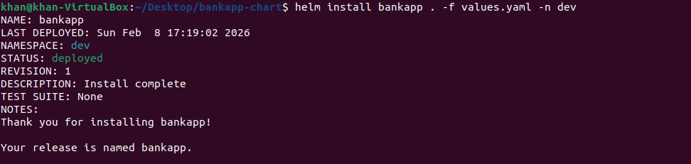
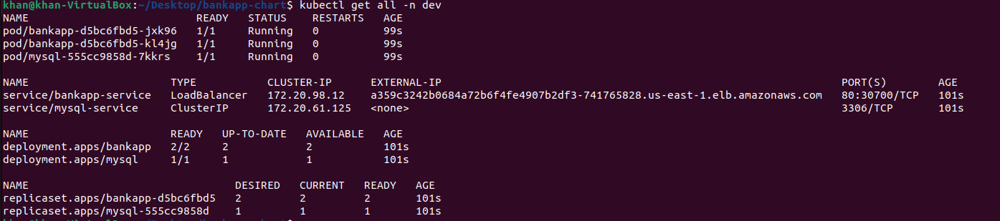
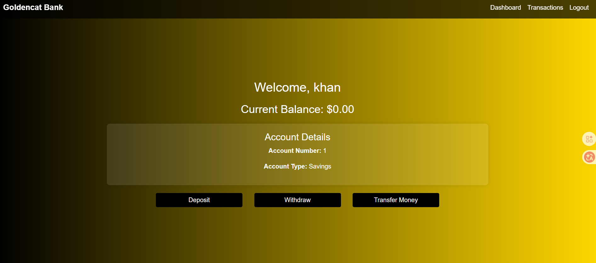

# BankApp Helm Chart

A Helm chart for deploying BankApp with MySQL database on Kubernetes (EKS).

## Prerequisites

- Kubernetes 
- Helm
- aws cli + eksctl
- EKS cluster with EBS CSI driver installed
- kubectl configured to communicate with your cluster

## Architecture

This chart deploys:
- MySQL 8 database with persistent storage (EBS)
- BankApp Spring Boot application (2 replicas)
- LoadBalancer service for external access
- Secrets and ConfigMaps for configuration

## Installation

### 1. Add or Update Dependencies

If you have chart dependencies, update them:
```bash
helm dependency update
```

### 2. Install the Chart

**Installation:**
```bash
kubectl create namespace dev
helm install bankapp . -f values.yaml -n dev
```

### 3. Verify Installation

```bash
# Check release status
helm status bankapp

kubectl get all -n dev
```

## Configuration

The following table lists the configurable parameters and their default values.

### MySQL Configuration

| Parameter | Description | Default |
|-----------|-------------|---------|
| `mysql.enabled` | Enable MySQL deployment | `true` |
| `mysql.image` | MySQL image | `mysql:8` |
| `mysql.database` | Database name | `bankappdb` |
| `mysql.rootPassword` | Root password | `Test@123` |
| `mysql.storage.size` | PVC size | `5Gi` |
| `mysql.storage.storageClassName` | Storage class | `ebs-sc` |
| `mysql.resources.requests.memory` | Memory request | `500Mi` |
| `mysql.resources.requests.cpu` | CPU request | `500m` |
| `mysql.resources.limits.memory` | Memory limit | `1Gi` |
| `mysql.resources.limits.cpu` | CPU limit | `1` |
| `mysql.service.type` | Service type | `ClusterIP` |

### BankApp Configuration

| Parameter | Description | Default |
|-----------|-------------|---------|
| `bankapp.enabled` | Enable BankApp deployment | `true` |
| `bankapp.image` | BankApp image | `fasih6/bankapp:v1` |
| `bankapp.replicas` | Number of replicas | `2` |
| `bankapp.resources.requests.memory` | Memory request | `500Mi` |
| `bankapp.resources.requests.cpu` | CPU request | `500m` |
| `bankapp.resources.limits.memory` | Memory limit | `1Gi` |
| `bankapp.resources.limits.cpu` | CPU limit | `1` |
| `bankapp.service.type` | Service type | `LoadBalancer` |
| `bankapp.service.port` | Service port | `80` |
| `bankapp.initContainer.enabled` | Enable init container | `true` |

### Storage Class Configuration

| Parameter | Description | Default |
|-----------|-------------|---------|
| `storageClass.enabled` | Enable storage class creation | `true` |
| `storageClass.name` | Storage class name | `ebs-sc` |
| `storageClass.type` | EBS volume type | `gp3` |
| `storageClass.reclaimPolicy` | Reclaim policy | `Retain` |

## Upgrading

```bash
helm upgrade bankapp . -f values.yaml -n dev

# Upgrade with specific parameters
helm upgrade bankapp ./bankapp-chart --set bankapp.replicas=3
```

## Uninstallation

```bash
helm uninstall bankapp -n dev

```


**Note:** PVCs are not automatically deleted. To remove them:
```bash
kubectl delete pvc mysql-pvc
```

## Accessing the Application
```bash
kubectl get all -n dev
```




## Troubleshooting

### Check Pod Status
```bash
kubectl get pods
kubectl describe pod <pod-name>
kubectl logs <pod-name>
```

### Check MySQL Connection
```bash
kubectl run mysql-client --rm -it --restart=Never --image=mysql:8 \
  -- mysql -h mysql-service -u root -pTest@123 bankappdb
```

### Check PVC Status
```bash
kubectl get pvc
kubectl describe pvc mysql-pvc
```

### Common Issues

1. **Pods stuck in Pending**: Check if EBS CSI driver is installed
2. **MySQL not ready**: Check logs and increase initialDelaySeconds
3. **Application can't connect to MySQL**: Verify service name and credentials
4. **LoadBalancer not getting IP**: Check AWS load balancer controller

## Security Considerations

⚠️ **IMPORTANT**: The default configuration stores passwords in plain text. For production:

1. Use Kubernetes Secrets with encryption at rest
2. Use AWS Secrets Manager or Parameter Store
3. Use External Secrets Operator
4. Use Sealed Secrets
5. Implement proper RBAC policies
6. Restrict SSH access in security groups
7. Enable network policies

## Production Recommendations

1. **Resource Limits**: Adjust based on load testing
2. **Replicas**: Scale based on traffic patterns
3. **Monitoring**: Add Prometheus metrics
4. **Logging**: Configure centralized logging
5. **Backup**: Implement database backup strategy
6. **High Availability**: Use multiple availability zones
7. **Auto-scaling**: Implement HPA for bankapp

## Support

For issues and questions:
- Check logs: `kubectl logs -l app=bankapp`
- Review events: `kubectl get events --sort-by='.lastTimestamp'`
- Describe resources: `kubectl describe <resource> <name>`

