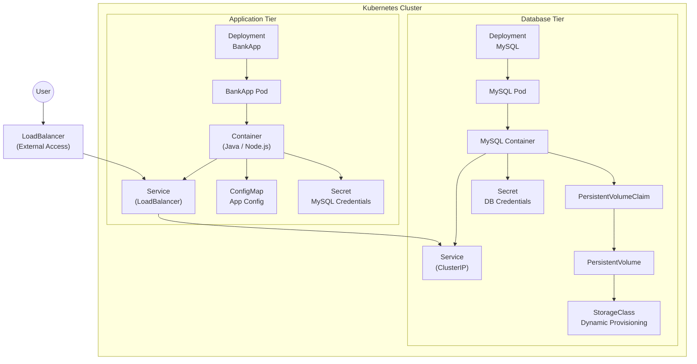

```mermaid
flowchart TB
    %% External Access
    User((User))
    LB["LoadBalancer
    (External Access)"]
    User --> LB
    
    %% Kubernetes Cluster
    subgraph K8s[Kubernetes Cluster]
        %% Application Tier
        subgraph AppTier[Application Tier]
            BankDeploy["Deployment
            BankApp"]
            BankPod[BankApp Pod]
            BankContainer["Container
            (Java / Node.js)"]
            BankService["Service
            (LoadBalancer)"]
            ConfigMap["ConfigMap
            App Config"]
            AppSecret["Secret
            MySQL Credentials"]
            
            BankDeploy --> BankPod
            BankPod --> BankContainer
            BankContainer --> ConfigMap
            BankContainer --> AppSecret
            BankContainer --> BankService
        end
        
        %% Database Tier
        subgraph DBTier[Database Tier]
            MySQLDeploy["Deployment
            MySQL"]
            MySQLPod[MySQL Pod]
            MySQLContainer[MySQL Container]
            MySQLService["Service
            (ClusterIP)"]
            PVC[PersistentVolumeClaim]
            PV[PersistentVolume]
            StorageClass["StorageClass
            Dynamic Provisioning"]
            DBSecret["Secret
            DB Credentials"]
            
            MySQLDeploy --> MySQLPod
            MySQLPod --> MySQLContainer
            MySQLContainer --> MySQLService
            MySQLContainer --> PVC
            MySQLContainer --> DBSecret
            PVC --> PV
            PV --> StorageClass
        end
        
        %% Internal Communication
        BankService --> MySQLService
    end
    
    %% External traffic enters cluster
    LB --> BankService

```

