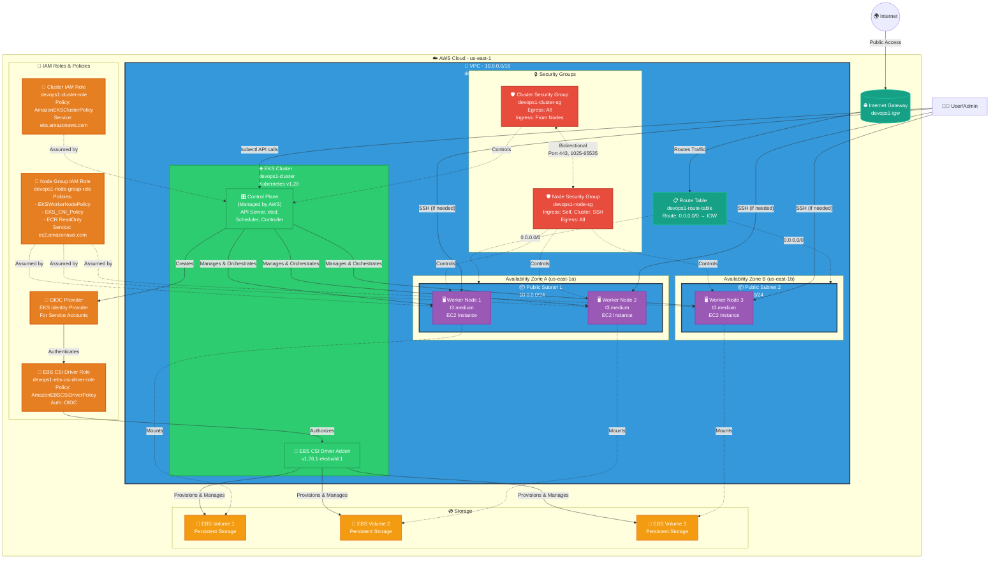

```mermaid
graph TB
    subgraph AWS["☁️ AWS Cloud - us-east-1"]
        IGW[("🌐 Internet Gateway<br/>devops1-igw")]
        
        subgraph VPC["🔷 VPC - 10.0.0.0/16<br/>devops1-vpc"]
            RT["📋 Route Table<br/>devops1-route-table<br/>Route: 0.0.0.0/0 → IGW"]
            
            subgraph AZ1["Availability Zone A (us-east-1a)"]
                subgraph Subnet1["📦 Public Subnet 1<br/>10.0.0.0/24"]
                    Node1["🖥️ Worker Node 1<br/>t3.medium<br/>EC2 Instance"]
                    Node2["🖥️ Worker Node 2<br/>t3.medium<br/>EC2 Instance"]
                end
            end
            
            subgraph AZ2["Availability Zone B (us-east-1b)"]
                subgraph Subnet2["📦 Public Subnet 2<br/>10.0.1.0/24"]
                    Node3["🖥️ Worker Node 3<br/>t3.medium<br/>EC2 Instance"]
                end
            end
            
            subgraph EKS["⎈ EKS Cluster<br/>devops1-cluster<br/>Kubernetes v1.28"]
                ControlPlane["🎛️ Control Plane<br/>(Managed by AWS)<br/>API Server, etcd,<br/>Scheduler, Controller"]
                EBSAddon["💾 EBS CSI Driver Addon<br/>v1.26.1-eksbuild.1"]
            end
            
            subgraph Security["🔒 Security Groups"]
                ClusterSG["🛡️ Cluster Security Group<br/>devops1-cluster-sg<br/>Egress: All<br/>Ingress: From Nodes"]
                NodeSG["🛡️ Node Security Group<br/>devops1-node-sg<br/>Ingress: Self, Cluster, SSH<br/>Egress: All"]
            end
        end
        
        subgraph IAM["👤 IAM Roles & Policies"]
            ClusterRole["🔑 Cluster IAM Role<br/>devops1-cluster-role<br/>Policy: AmazonEKSClusterPolicy<br/>Service: eks.amazonaws.com"]
            NodeRole["🔑 Node Group IAM Role<br/>devops1-node-group-role<br/>Policies:<br/>- EKSWorkerNodePolicy<br/>- EKS_CNI_Policy<br/>- ECR ReadOnly<br/>Service: ec2.amazonaws.com"]
            OIDC["🔐 OIDC Provider<br/>EKS Identity Provider<br/>For Service Accounts"]
            EBSRole["🔑 EBS CSI Driver Role<br/>devops1-ebs-csi-driver-role<br/>Policy: AmazonEBSCSIDriverPolicy<br/>Auth: OIDC"]
        end
        
        subgraph Storage["💿 Storage"]
            EBS1["📀 EBS Volume 1<br/>Persistent Storage"]
            EBS2["📀 EBS Volume 2<br/>Persistent Storage"]
            EBS3["📀 EBS Volume 3<br/>Persistent Storage"]
        end
    end
    
    Internet(("🌍 Internet"))
    User["👨‍💻 User/Admin"]
    
    %% Internet connections
    Internet -->|"Public Access"| IGW
    IGW -->|"Routes Traffic"| RT
    
    %% Route table to subnets
    RT -.->|"0.0.0.0/0"| Subnet1
    RT -.->|"0.0.0.0/0"| Subnet2
    
    %% EKS Control Plane connections
    ControlPlane -->|"Manages & Orchestrates"| Node1
    ControlPlane -->|"Manages & Orchestrates"| Node2
    ControlPlane -->|"Manages & Orchestrates"| Node3
    
    %% IAM Role assumptions
    ClusterRole -.->|"Assumed by"| ControlPlane
    NodeRole -.->|"Assumed by"| Node1
    NodeRole -.->|"Assumed by"| Node2
    NodeRole -.->|"Assumed by"| Node3
    
    %% Security Group associations
    ClusterSG -.->|"Controls"| ControlPlane
    NodeSG -.->|"Controls"| Node1
    NodeSG -.->|"Controls"| Node2
    NodeSG -.->|"Controls"| Node3
    
    %% OIDC and EBS CSI Driver
    ControlPlane -->|"Creates"| OIDC
    OIDC -->|"Authenticates"| EBSRole
    EBSRole -->|"Authorizes"| EBSAddon
    EBSAddon -->|"Provisions & Manages"| EBS1
    EBSAddon -->|"Provisions & Manages"| EBS2
    EBSAddon -->|"Provisions & Manages"| EBS3
    
    %% Storage attachments
    Node1 -.->|"Mounts"| EBS1
    Node2 -.->|"Mounts"| EBS2
    Node3 -.->|"Mounts"| EBS3
    
    %% User access
    User -->|"kubectl API calls"| ControlPlane
    User -->|"SSH (if needed)"| Node1
    User -->|"SSH (if needed)"| Node2
    User -->|"SSH (if needed)"| Node3
    
    %% Security group relationships
    ClusterSG <-.->|"Bidirectional<br/>Port 443, 1025-65535"| NodeSG
    
    %% Styling
    classDef vpcStyle fill:#3498db,stroke:#2c3e50,stroke-width:3px,color:#fff
    classDef eksStyle fill:#2ecc71,stroke:#27ae60,stroke-width:3px,color:#fff
    classDef nodeStyle fill:#9b59b6,stroke:#8e44ad,stroke-width:2px,color:#fff
    classDef iamStyle fill:#e67e22,stroke:#d35400,stroke-width:2px,color:#fff
    classDef sgStyle fill:#e74c3c,stroke:#c0392b,stroke-width:2px,color:#fff
    classDef storageStyle fill:#f39c12,stroke:#e67e22,stroke-width:2px,color:#fff
    classDef networkStyle fill:#16a085,stroke:#1abc9c,stroke-width:2px,color:#fff
    
    class VPC,Subnet1,Subnet2 vpcStyle
    class EKS,ControlPlane,EBSAddon eksStyle
    class Node1,Node2,Node3 nodeStyle
    class ClusterRole,NodeRole,OIDC,EBSRole iamStyle
    class ClusterSG,NodeSG sgStyle
    class EBS1,EBS2,EBS3 storageStyle
    class IGW,RT networkStyle
```
